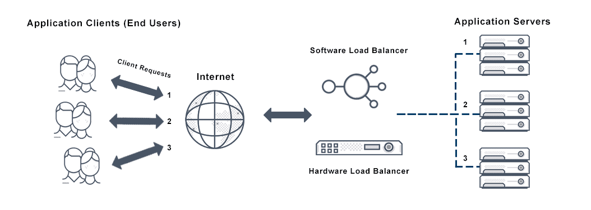

# Round Robin Load Balancer
A Round Robin Load Balancer is a simple algorithm used to distribute client requests across a group of servers. Each incoming request is assigned to the next server in the list, cycling back to the start once the end is reached. This ensures that all servers handle an approximately equal number of requests, helping to balance the load and improve overall system reliability.


## Parts of the projects
#### CMD (main.go)
- it is the main entry point of the project


#### Internals 
(not planning to use as a package)

Packages 
- Proxy : Receiving the request from the user and sending it to the 
- Balancer: It handles the internal mechanism of round robin algorithm
- Config: It is used to load the configuration from yaml file
- Main:(cmd/main.go) it handles the logic of sending the requests to the servers from the config file 



## Config Content
- Port : Refers to the port number load balancer is listening to 
- servers : Refers to the registered servers that are in golang


## Run
```bash
go mod tidy
go run cmd/main.go --config=config.yaml
```